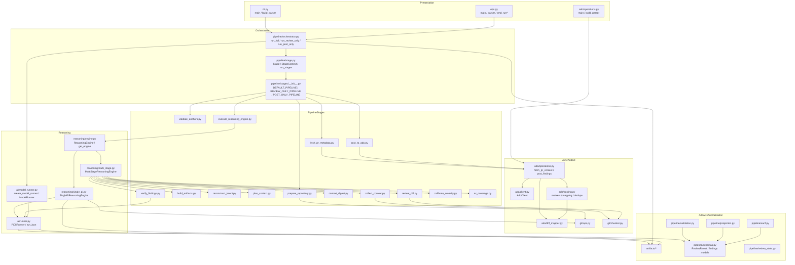
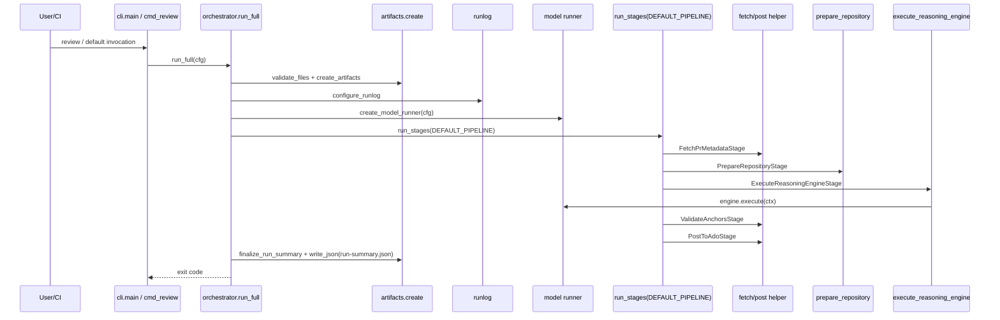
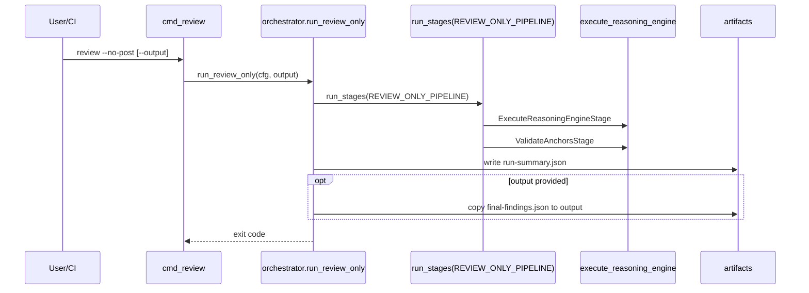
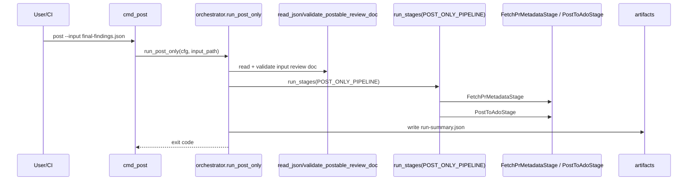
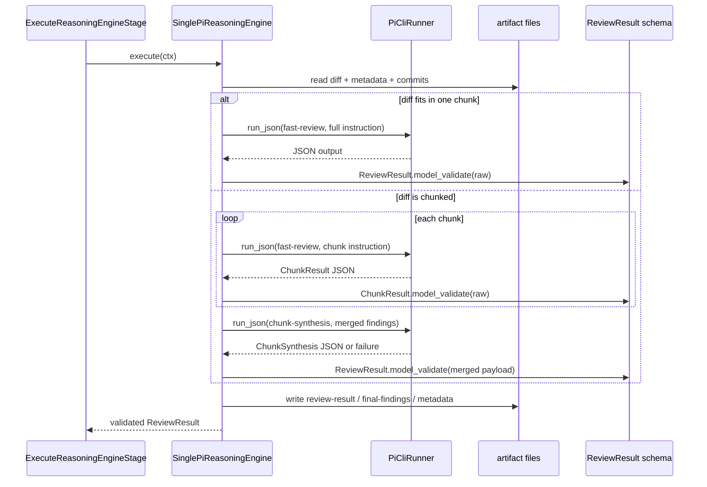
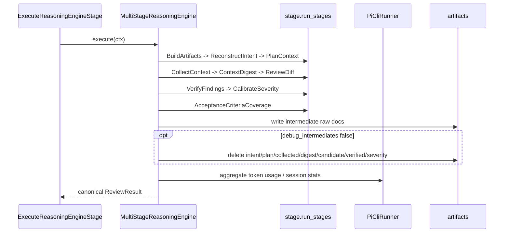
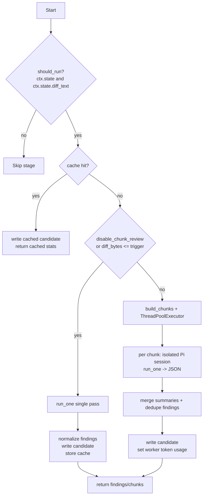

# ReviewForge Deep Repository Analysis

Scope: `src/reviewforge/**`, `tests/**`, package metadata, and the runtime workflows visible in code.  
Primary sources used: codegraph traces, direct file reads, and test grep results.

## 1. Executive Summary

ReviewForge is a deterministic Python orchestration layer around two review engines: the default `single_pi` path and the legacy `multi_stage` path. The CLI drives a staged pipeline that fetches ADO metadata, prepares a git diff, executes a reasoning engine, validates anchors, and posts findings back to Azure DevOps. The strongest design choice is the explicit stage boundary (`Stage`, `StageContext`, `StageResult`) plus Pydantic validation of model output; the main risk is the very wide mutable context bag and the many string-keyed extras that couple stages together. [INFERENCE]

The repo is generally well-covered around the high-value flows (`run_full`, `run_review_only`, `run_post_only`, `single_pi` chunking, anchor validation, stale reconciliation), but there are clear blind spots: the Pi subprocess boundary (`run_json`), the legacy post-only pipeline constant, and the ADO helper wrappers (`post_findings`, `fetch_pr_context`) have no direct covering tests reported by codegraph. The runtime also depends on several external tools and API versions (`pi`, `git`, `rg`, Azure DevOps REST versions), so version drift there is a real operational risk.

## 2. Architecture Overview

### System / Container Diagram

```mermaid
graph TB
  User[User / CI / PowerShell / bash]
  CLI[reviewforge.cli\n(primary entrypoint)]
  OPS[reviewforge.ops\n(legacy container helpers)]
  ADOCLI[reviewforge.ado.operations / ado.cli\n(fetch-context, post-findings)]
  ORCH[reviewforge.pipeline.orchestrator]
  STAGE[reviewforge.pipeline.stage\n(Stage runner)]
  STAGES[reviewforge.pipeline.stages\n(fetch, prepare, reason, validate, post)]
  REASON[reviewforge.reasoning\n(single_pi, multi_stage)]
  AI[reviewforge.ai\n(model runner + prompt handling)]
  ADO[Azure DevOps REST API]
  PI[pi CLI subprocess]
  GIT[git CLI / repo ops]
  RG[ripgrep subprocess]
  ART[reviewforge.artifacts\n(per-run artifact tree)]
  RUNLOG[reviewforge.runlog]

  User --> CLI
  User --> OPS
  User --> ADOCLI
  CLI --> ORCH
  OPS --> ORCH
  ADOCLI --> ADO
  ORCH --> ART
  ORCH --> RUNLOG
  ORCH --> STAGE
  STAGE --> STAGES
  STAGES --> REASON
  REASON --> AI
  REASON --> PI
  STAGES --> ADO
  STAGES --> GIT
  STAGES --> RG
  STAGES --> ART
  AI --> PI
  ADO --> ADOCLI
  GIT --> ART
  RG --> ART
```

### Public entry points and APIs

- CLI entry points
  - `reviewforge.__main__ -> reviewforge.cli.main`
  - `reviewforge.cli.main(argv)`
  - `reviewforge.ops.main(argv)`
  - `reviewforge.ado.operations.main(argv)` / `reviewforge.ado.cli`
- Public orchestration APIs
  - `reviewforge.pipeline.orchestrator.run_full(cfg)`
  - `reviewforge.pipeline.orchestrator.run_review_only(cfg, output=None)`
  - `reviewforge.pipeline.orchestrator.run_post_only(cfg, input_path=...)`
- Core abstractions
  - `Stage`, `StageContext`, `StageResult`, `run_stages`
  - `ReasoningEngine`, `get_engine`, `register_engine`
  - `ModelRunner`, `create_model_runner`
  - `AdoClient`
  - `Artifacts`, `create`, `ARTIFACT_NAMES`
  - `ReviewResult` (canonical model output)
- Internal contracts
  - `ctx.extras` keys: `review_state`, `review_context`, `wi_context`, `wi_comments_context`, `thread_context`, `paths`, `_finding_counts`, `_worker_token_usage`, `_synthesis_fallback`, `system_prompt`
  - `StageLabel` / `validate_stage` / `validate_review_doc` / `validate_postable_review_doc`

### External dependencies and version risk

- Python dependencies from `pyproject.toml`
  - `pydantic>=2.5`
  - `jinja2>=3.1`
  - dev/test: `pytest>=8.0`, `pytest-cov>=4.1`
- Runtime toolchain dependencies
  - `pi` CLI: required by `PiCliRunner.run_json`
  - `git`: required by `reviewforge.git.ops`
  - `rg` / ripgrep: required by `CollectContextStage`
  - Azure DevOps REST API: hard-coded `api-version=7.0`, `7.1`, `7.1-preview.1`
- Version risk notes
  - `pydantic` v2 model validation/dump semantics are central to `ReviewResult` and stage schemas.
  - `jinja2` filters/macros drive comment rendering; template compatibility matters.
  - The `pi` CLI contract is parsed from stderr token-usage text; output format drift will affect token accounting.
  - Azure DevOps API version strings are pinned in code; server-side changes can break fetch/post behavior.

### Cycles and coupling

- No hard import cycle was exposed by codegraph in the main runtime path. [INFERENCE]
- Controlled bootstrap coupling exists in `reviewforge.reasoning.engine`: it registers `single_pi` and `multi_stage` by importing them at module bottom.
- High coupling hot spots
  - `StageContext`: many stages read/write the same mutable bag.
  - `pipeline.stages.__init__`: imports all stage classes and defines fixed pipeline lists.
  - `ReviewDiffStage` / `VerifyFindingsStage`: both depend on runner session isolation conventions and artifact paths.
  - `ado.operations.command_post_findings`: owns dedupe, fallback mapping, stale reconciliation, voting, and fail-on logic in one branch-heavy function.

## 3. CodeGraph as Mermaid



## 4. Workflow Diagrams

### 4.1 Full review workflow (`reviewforge review` / `run_full`)



### 4.2 Review-only workflow (`review --no-post`)



### 4.3 Post-only workflow (`post` / `run_post_only`)



### 4.4 Single-Pi reasoning workflow (`single_pi`)



### 4.5 Multi-stage reasoning workflow (`multi_stage`)



## 5. Logic Conditions

### Complex condition inventory

- `Stage.__call__`
  - `should_run(ctx)` gate → `SKIPPED`
  - `ReviewForgeError` / `SystemExit` / generic `Exception` capture
  - token usage source stamping when `invocation_count` increases
- `AdoClient._request`
  - retryable vs non-retryable errors
  - HTTP status list for retries (`429`, `500`, `502`, `503`, `504`)
  - retry budget check before sleeping
- `FetchPrMetadataStage.run`
  - cached metadata short-circuit
  - review-mode detection after fetch or cache hit
- `ValidateAnchorsStage.run`
  - skip work-item findings / unfiled findings
  - anchor valid vs downgrade vs drop based on `anchor_policy`
  - stale finding propagation into `ctx.review_result.discarded_findings`
- `PostToAdoStage.run`
  - synthesize `ctx.final` from `ctx.review_result`
  - dry-run print-only branch
  - post helper failure recovery (read back `posted-findings.json`)
- `ReviewDiffStage.run`
  - cache hit
  - single-pass review vs chunked review
  - isolated Pi sessions per worker (`PiCliRunner` / `PiRunner` type-name check)
  - dedupe findings across chunks
- `SinglePiReasoningEngine.execute`
  - one-chunk path vs chunked path
  - synthesis attempt vs deterministic fallback
  - schema validation failures for `ReviewResult` / `ChunkResult`
- `AcceptanceCriteriaCoverageStage.run`
  - opt-out via env vars
  - no work items / no diff fast returns
  - optional LLM reassessment of uncovered ACs

### Flowchart: `ReviewDiffStage.run`



## 6. Critical Findings

### P0 — immediate

- No confirmed P0 defect from static analysis. [INFERENCE]

### P1 — soon

1. **`PiCliRunner.run_json` has no direct covering tests.**
   - Evidence: codegraph reported `run_json` in `src/reviewforge/ai/runner.py` with no covering tests found.
   - Impact: every reasoning path depends on this subprocess boundary; regressions here break `single_pi`, verification stages, and token accounting.
2. **`POST_ONLY_PIPELINE` has no direct covering tests.**
   - Evidence: codegraph reported `POST_ONLY_PIPELINE` with no covering tests found.
   - Impact: the post-only path is a separate entry point from full review; it can drift unnoticed.
3. **`post_findings` / `fetch_pr_context` helper wrappers have no direct tests.**
   - Evidence: codegraph reported no covering tests for both helper functions in `src/reviewforge/ado/operations.py`.
   - Impact: stage wrappers rely on these helpers for all ADO I/O; a helper regression breaks both fetch and post workflows.
4. **`CollectContextStage` can silently degrade when `rg` fails or is missing.**
   - Evidence: `subprocess.run([...], stderr=subprocess.DEVNULL)` returns matches only; non-zero exit is not checked.
   - Impact: context collection may return empty search results without surfacing the root cause.
   - [INFERENCE] This is a correctness risk rather than a security bug.
5. **Retry policy is asymmetric in `AdoClient._request`.**
   - Evidence: only GET requests retry on transient HTTP/network errors; POST/PUT fail immediately.
   - Impact: transient ADO post failures are unrecovered, which can make posting fragile under brief outages.

### P2 — plan / hardening

1. **`StageContext` is a mutable god object.**
   - Many stages write to `ctx.extras` and shared top-level attributes.
   - Risk: hidden coupling, fragile ordering, and key collisions.
2. **Worker isolation is keyed on class-name strings.**
   - `ReviewDiffStage` / `VerifyFindingsStage` check `type(ctx.pi).__name__ in {"PiCliRunner", "PiRunner"}`.
   - Risk: renames or alternate implementations can bypass isolation.
3. **`work-item-comments.json` is an implicit artifact contract.**
   - It is loaded from disk but not declared in `ARTIFACT_NAMES` or the `Artifacts` dataclass.
   - Risk: silent schema drift between fetch and consume paths.
4. **The legacy ADO posting helper owns too many concerns.**
   - `command_post_findings` handles validation, dedupe, line mapping, fallback contexts, stale reconciliation, voting, and fail-on policy.
   - Risk: hard to change safely; branching complexity is high.

## 7. Recommended Measures

| Priority | Action | Effort | Why |
|---|---|---:|---|
| P1 | Add direct unit tests for `PiCliRunner.run_json` repair, token parsing, and timeout paths | M | Covers the highest-leverage subprocess boundary. |
| P1 | Add a focused test for `POST_ONLY_PIPELINE` composition and `run_post_only` happy path | S | Prevents regression in the separate post-only entry point. |
| P1 | Make `CollectContextStage` fail loudly when `rg` is unavailable or returns non-zero for a query that should matter | M | Avoids silent loss of search context. |
| P1 | Add direct tests for `post_findings` and `fetch_pr_context` helper wrappers | S | Protects the fetch/post helper boundary. |
| P2 | Introduce typed constants or a small dataclass for `ctx.extras` keys | M | Reduces stringly-typed coupling across stages. |
| P2 | Replace runner type-name checks with a tiny capability flag or helper function | S/M | Keeps session isolation robust across refactors. |
| P2 | Declare `work-item-comments.json` in the artifact contract or encode the derivation explicitly in one place | S | Removes a hidden file contract. |
| P2 | Split `command_post_findings` into smaller helpers if future changes touch it again | L | Lower cognitive load; easier to test. |

## 8. Onboarding Checklist for New Developers

- Read `AGENTS.md` and this analysis before changing runtime behavior.
- Trace the main flow in this order:
  1. `src/reviewforge/cli.py`
  2. `src/reviewforge/pipeline/orchestrator.py`
  3. `src/reviewforge/pipeline/stages/__init__.py`
  4. `src/reviewforge/reasoning/single_pi.py`
  5. `src/reviewforge/reasoning/multi_stage.py`
  6. `src/reviewforge/ado/operations.py`
- Run the common entry points locally:
  - `python -m reviewforge --help`
  - `python -m reviewforge review --no-post`
  - `python -m reviewforge post --input <file>`
  - `python -m reviewforge discover --project <project>`
- Learn the artifact layout:
  - `artifacts/pr-<PR_ID>/runs/<RUN_ID>/`
  - `final-findings.json`, `review-result.json`, `run-summary.json`, `posted-comments.json`, `raw/`
- Know the key runtime knobs:
  - `ADO_*` for Azure DevOps auth/project wiring
  - `PI_*` / `MODEL_BACKEND` for the reasoning backend
  - `AC_COVERAGE_*`, `VERIFY_FINDINGS`, `FAIL_ON`, `POST_MIN_SEVERITY`, `ANNOTATE_STALE`
- When changing a stage, inspect its paired test file first:
  - `tests/test_stages.py`
  - `tests/test_reasoning.py`
  - `tests/test_orchestrator.py`
  - `tests/test_integration.py`
  - `tests/test_session_reuse.py`
  - `tests/test_validate_anchors.py`
- Prefer the canonical `ReviewResult` path; legacy projections are boundary-only.
- Preserve artifact names and the `prb:<dedupe-key>` marker layout.

## 9. Notes on Coupling and Design Patterns

### Patterns present

- Pipeline/stage pattern: each stage is a unit of work with `should_run` and `run`.
- Strategy/registry pattern: `ReasoningEngine` registry selects `single_pi` vs `multi_stage`.
- Adapter pattern: `PiCliRunner` adapts the external `pi` CLI into a `ModelRunner` protocol.
- Facade pattern: `orchestrator.run_full/run_review_only/run_post_only` hide stage details.
- Template/formatter pattern: `ado.comment_format` renders findings bodies.

### SOLID notes

- **S**: weak in the pipeline; stages are small, but `StageContext` and `command_post_findings` do too much.
- **O**: good; engines and stages are extensible via registration and subclassing.
- **L**: mostly okay; `Stage` subclasses respect the runner contract.
- **I**: `ModelRunner` is tidy; `StageContext` is not an interface, it is a shared mutable bag.
- **D**: orchestration depends on concrete stage classes and exact helper functions; fine for this scale, but not as decoupled as it could be.

### Security notes

- Good:
  - ADO credentials are scrubbed from the Pi subprocess environment.
  - Diff and search helpers use fixed argument lists, not shell interpolation.
  - ADO posting uses marker dedupe and stale reconciliation instead of blind reposting.
- Watch:
  - `rg`, `git`, and `pi` are external executables on PATH.
  - `AdoClient` trusts the configured organization/project/repo to build URLs.
  - `command_post_findings` intentionally falls back to PR-level comments when file mapping is unavailable; this is safe, but it is a behavior choice.

### Performance notes

- Hot paths
  - `ReviewDiffStage` chunking and merging.
  - `VerifyFindingsStage` parallel finding verification.
  - `CollectContextStage` parallel file/test/search collection.
  - `AcceptanceCriteriaCoverageStage` reassessment loop.
- Potential scaling issues
  - Multiple one-by-one Pi invocations (`N+1` style) for large diffs, many findings, or many uncovered ACs.
  - Synchronous `urllib.request.urlopen` calls in ADO paths.
  - Large diffs are kept in memory in `ctx.state.diff_text` and artifact files.
- Deadlocks/races
  - No explicit lock-based deadlock was visible. [INFERENCE]
  - Race risk is concentrated in Pi session reuse; the code compensates with per-worker session ids.

## 10. Coverage Gaps by Critical Path

| Critical path | Test coverage evidence | Gap |
|---|---|---|
| `run_full` orchestration | `tests/test_orchestrator.py`, `tests/test_integration.py`, `tests/test_session_reuse.py` | Good coverage; still relies on many stubs. |
| `run_review_only` | `tests/test_orchestrator.py`, `tests/test_integration.py` | Good coverage. |
| `run_post_only` | `tests/test_orchestrator.py`, `tests/test_integration.py` | Good coverage, but the pipeline constant itself lacks direct coverage. |
| `single_pi` chunking / synthesis | `tests/test_reasoning.py`, `tests/test_session_reuse.py` | Good coverage. |
| `multi_stage` engine | `tests/test_reasoning.py` | Good coverage around happy path and failure propagation. |
| ADO posting / stale reconciliation | `tests/test_posting.py`, `tests/test_stale_reconciliation.py`, `tests/test_integration.py` | Good coverage, but helper wrapper functions still lack direct tests. |
| `PiCliRunner.run_json` | no covering tests reported by codegraph | Gap. |
| `POST_ONLY_PIPELINE` constant | no covering tests reported by codegraph | Gap. |
| `post_findings` / `fetch_pr_context` wrappers | no covering tests reported by codegraph | Gap. |

---

End of analysis.
